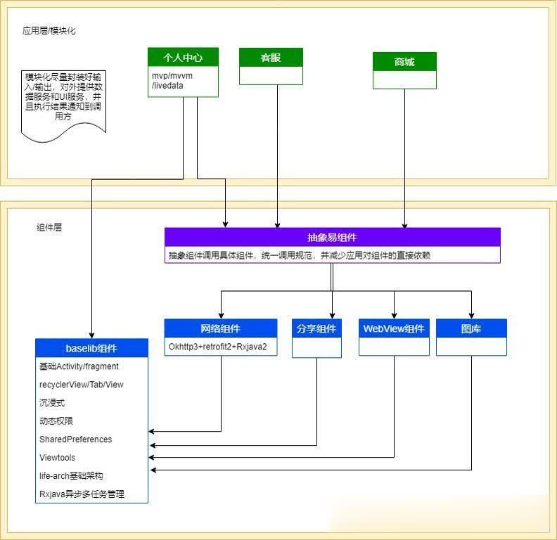

# EasyApp(抽象易组件)
[](https://jitpack.io/#sange93/EasyApp)  
Android App 快速开发框架  
架构：Jetpack MVVM  
组件化架构图：  
  
easy组件[使用说明](easy/README.md),此组件依赖于[base组件](https://github.com/sange93/BaseApp)，须共同使用；
## 引入依赖（gradle）
Step 1. Add the JitPack repository to your build file  
Add it in your root build.gradle at the end of repositories:
```gradle
allprojects {
		repositories {
			...
			maven { url 'https://jitpack.io' }
		}
	}
```
Step 2. Add the dependency
```gradle
dependencies {
	        implementation 'com.github.sange93:EasyApp:1.0.1'
	}
```